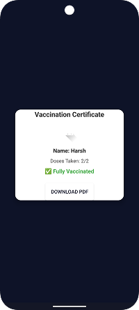

# 🚑 **CoviLink**

CoviLink is an Android application designed to help users register for COVID-19 vaccination, book slots, and download vaccination certificates. 
It also provides an admin portal for managing slots and tracking user vaccination status._

---

## 🌟 **Features**

### 👤 **User Module**

- **Register & Login**: Secure authentication using **Firebase**.
- **Dashboard**: View vaccination status and doses taken.
- **Available Slots**: Browse and book vaccination slots.
- **My Appointments**: View and cancel your booked appointments.
- **Vaccination Certificate**: Download a PDF certificate after completing both doses.


### 🛡️ **Admin Module**

- **Admin Login**: Secure admin authentication.
- **Manage Slots**: Add, view, and delete vaccination slots.
- **User Records**: Search users by email and view their vaccination status and appointments.
- **Appointment Management**: View all appointments, and mark them as _“completed”_ or _“missed”_.

---

## 🖼️ **Screenshots**
###  Splashscreen


###  Dashboard


###  SignUp


###  Login


###  User Dashboard


###  Menu


###  Admin Dashboard


###  Certificate download




---

## 💻 **Tech Stack**

- **Android (Java)**
- **Firebase Authentication**
- **Firebase Realtime Database**
- **Cloudinary** (for profile images)
- **PDF Generation** (Android `PdfDocument`)
- **Modern Material UI**

---

## 🚀 **Getting Started**

### ✅ **Prerequisites**

- Android Studio (latest version recommended)
- A Firebase project (see setup below)

---

### ⚙️ **Setup**

**Clone the repository:**

```
bash
git clone https://github.com/yourusername/covilink.git
Replace yourusername with your GitHub username.

1.Firebase Setup:

Create a Firebase project at Firebase Console.
Enable Authentication (Email/Password).
Enable Realtime Database (in test mode for development).
Download google-services.json and place it in the app/ directory.

2.Build and Run:

Open the project in Android Studio.
Sync Gradle files.
Run the app on an emulator or real device.

```
# 🔐 **Admin Credentials**

- Default Admin Login:
- Email: admin@covilink.com
- Password: admin123
- (You can change these in AdminLoginActivity.java.)

---

# 📁 **Project Structure**

- app/src/main/java/com/harsh/covilink/ — All activities and logic
- app/src/main/res/layout/ — UI layouts
- app/src/main/res/drawable/ — Images and icons

---


# 🙏 **Acknowledgements**

- Firebase
- Cloudinary
- Android Developers
- Material Design

---


